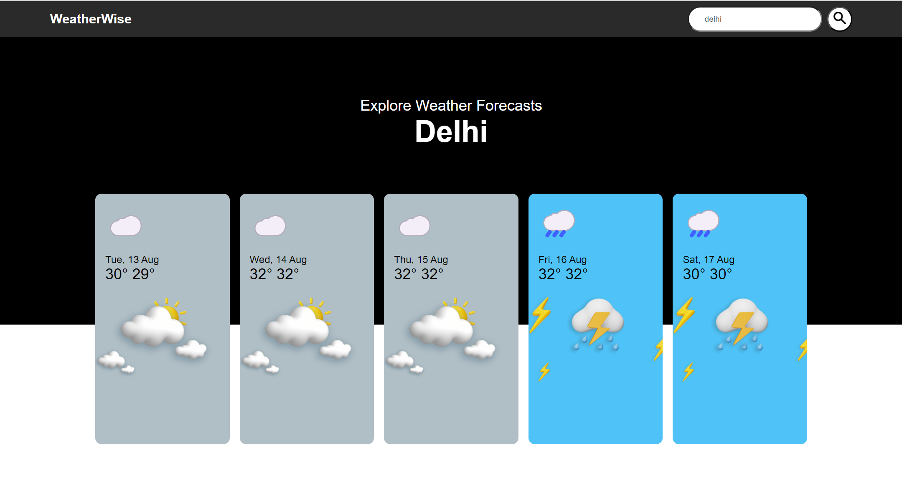
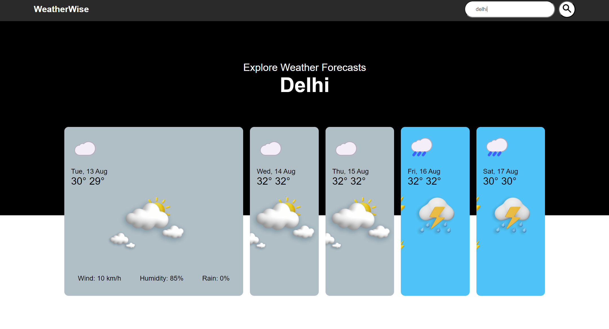
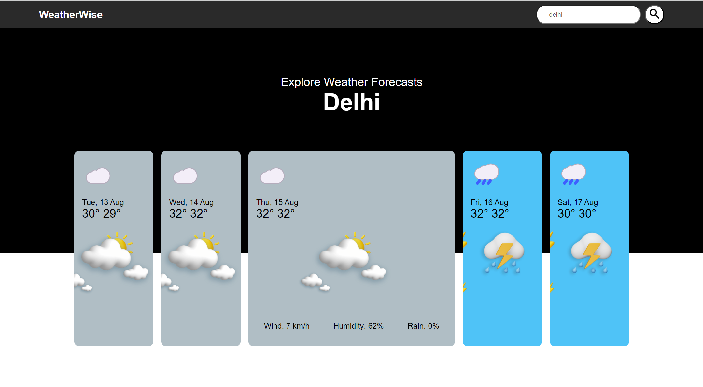

# WeatherWise

**WeatherWise** is a weather forecasting website that provides real-time weather updates. It offers accurate information on weather conditions such as temperature, wind speed, humidity, and precipitation.

## Features

- **Real-time Weather Updates:** Get the latest weather information for any location.
- **Detailed Weather Data:** Includes temperature, wind speed, humidity, and precipitation levels.

## Tools & Technologies Used

- **HTML:** Structure and layout of the website.
- **CSS:** Styling and design to enhance user experience.
- **JavaScript:** Dynamic content rendering and API integration.
- **OpenWeather API:** Fetching real-time weather data.

## Screenshot





## Project Setup

1. Clone the repository:

   ```bash
   git clone https://github.com/Aniket-Gavkare/WeatherWise.git
   ```
1. Open the project directory:

    ```bash
    cd weatherwise
    ```

2. Open `index.html` in your preferred web browser.

3. Enter the city name in the search bar to view the current weather conditions.

## API Integration

WeatherWise uses the OpenWeather API to retrieve weather data. Follow these steps to set up the API integration:

1. Sign up on the OpenWeather website to get your API key.

2. Replace the `apiKey` variable in the `script.js` file with your OpenWeather API key:

    ```javascript
    const apiKey = 'YOUR_API_KEY';
    ```
## Acknowledgements

- OpenWeather for providing the API.
- MDN Web Docs for valuable web development resources.
